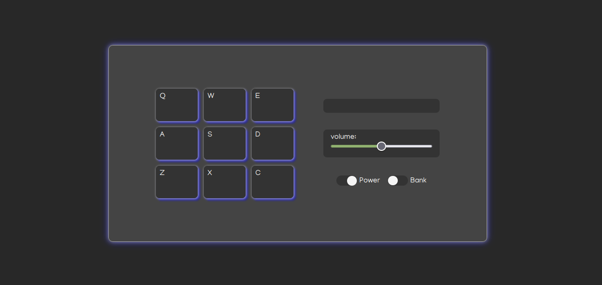
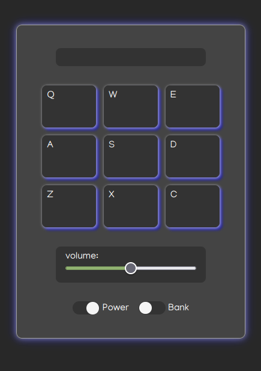

# virtual-drum

 

Online virtual drum pad, created with React

Live Demo: https://online-virtual-drum.netlify.app/

## Feature Overview

- press (keyboard keys or mouse click) to play 
- adjustable volume
- switch pad bank(drum kit)
- power off/on

## Tech Stack

- HTML
- SCSS
- ReactJS

## Screenshots

## Run Locally

After you clone this repo to your desktop, go to its root directory and run `npm install` to install its dependencies.

Once the dependencies are installed, you can run  `npm run dev` to start the application. You will then be able to access it at localhost

## License
>You can check out the full license [here](https://github.com/IgorAntun/node-chat/blob/master/LICENSE)

This project is licensed under the terms of the **MIT** license.